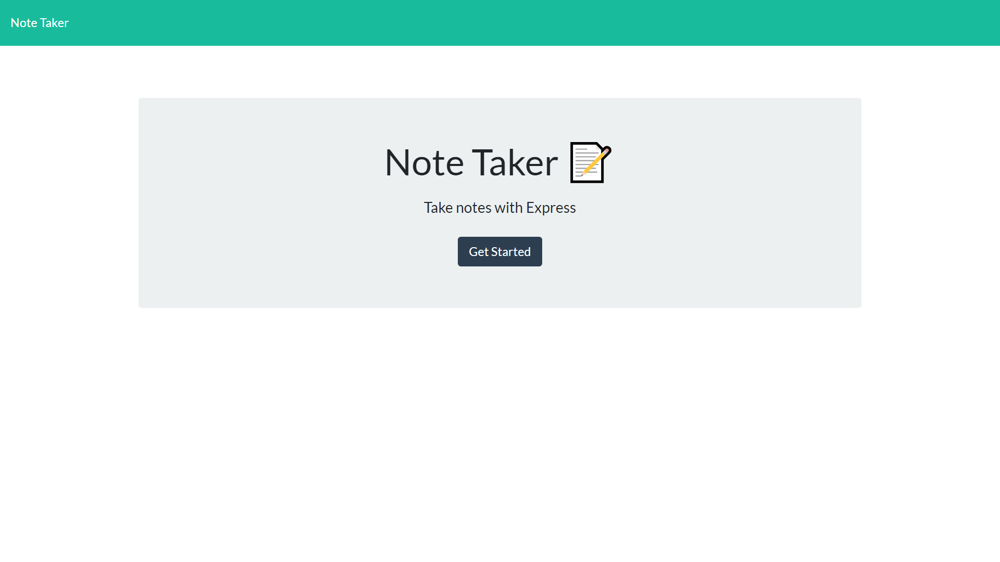
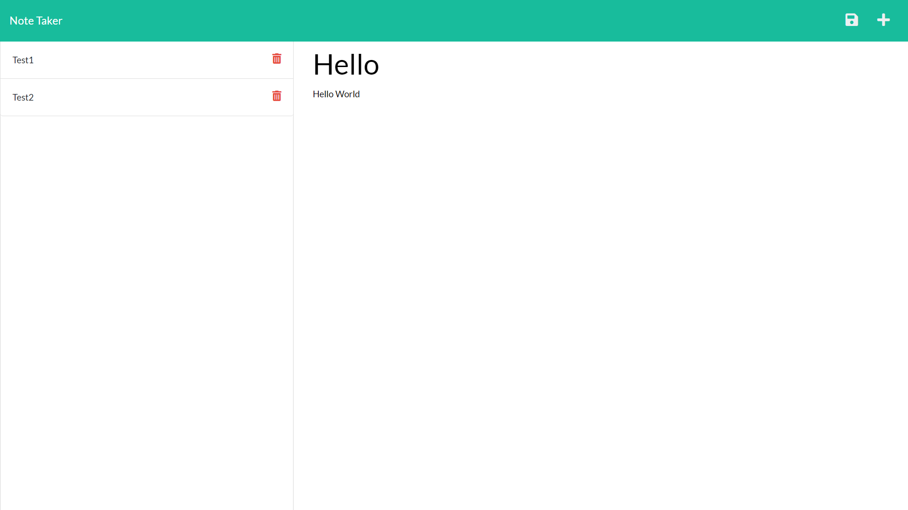

# express-note-taker

## Description
This application allows a user to input, save, and delete notes.  It utilises routing via an express server and is hosted on Heroku.  Notes can be retrieved from a sidebar which displays listed notes.  Users may also use calls to the /api/notes url to check the full JSON file of notes.

## Dependencies
Uses the following node package modules:
* Express
* Uniqid (to create id's for notes)

## Splash Page

## Main Page

## Links
Check out the live application here:

https://evening-wildwood-48196.herokuapp.com/